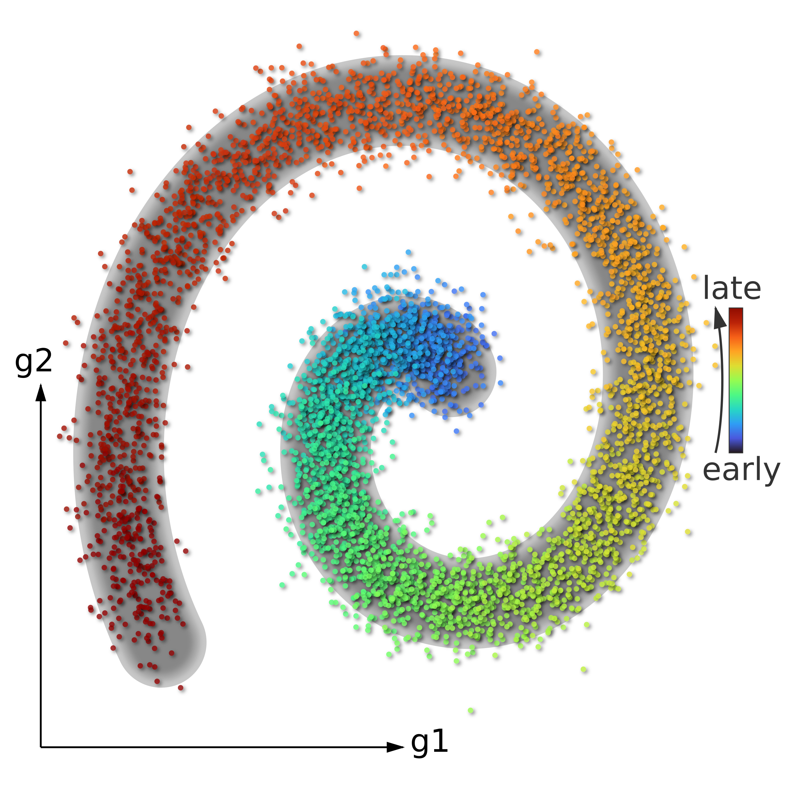
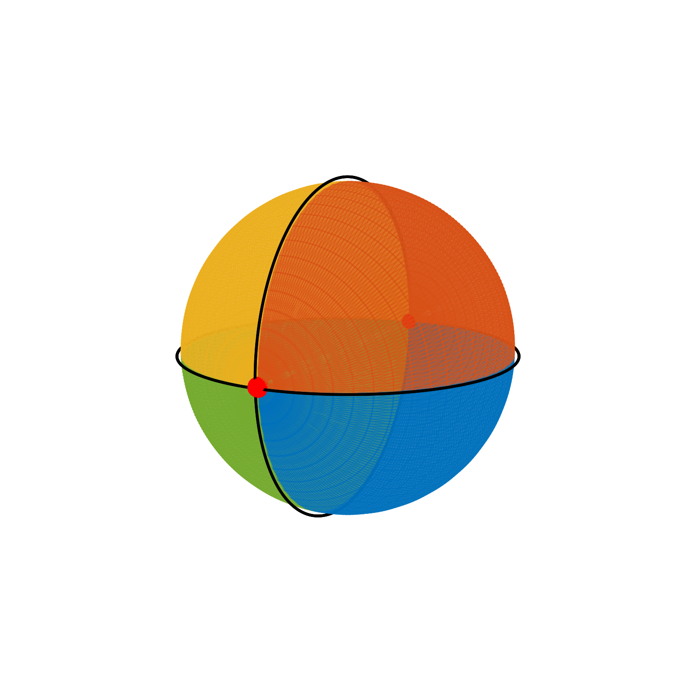

draw some stuffs using d3.js

## Examples

<table>
  <tr>
    <th>scatter plot</th>
    <th>sphere tiled</th>
  </tr>
  <tr>
    <td width="50%">
      
    </td>
    <td width="50%">
      
    </td>
  </tr>
</table>
